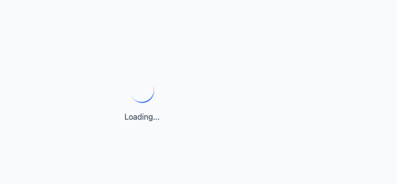
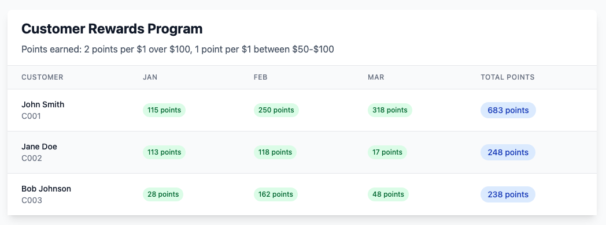

# Simple rewards React Ui

## Running the app Locally
`npm install`

`npm run dev`

## Run tests.

`npm run test`

## Images

This project includes two example images in `src/assets`: `loading.png` and `overview.png`.

